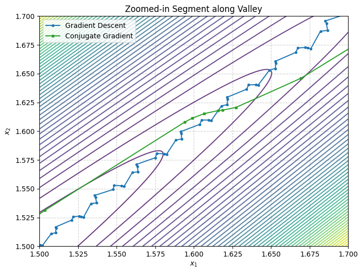

# Numerical Optimization: Unconstrained Minimization Methods

This project investigates and compares three unconstrained numerical optimization techniques implemented from scratch in Python: **Gradient Descent**, **Newton's Method**, and the **Fletcher-Reeves Non-Linear Conjugate Gradient method**.

---

## Objective Function & Mathematical Setup

The problem focuses on minimizing an ill-conditioned, non-convex quadratic objective function:

$$f(x_1, x_2) = 100(x_2 - x_1)^2 + (1 - x_1)^2$$

* **Global Minimum**: $x^* = (1, 1)$, where $f(x^*) = 0$.
* **Starting Point**: $x_0 = (2, 5)$.
* **Gradient**: 
  $$\nabla f(x) = \begin{bmatrix} -200(x_2 - x_1) - 2(1 - x_1) \\ 200(x_2 - x_1) \end{bmatrix}$$
* **Hessian**: 
  $$\nabla^2 f(x) = \begin{bmatrix} 202 & -200 \\ -200 & 200 \end{bmatrix}$$

### Geometry & Constraints
The large coefficient of $100$ heavily amplifies the curvature along the $(x_2 - x_1)$ direction, creating highly elongated elliptical level sets and a narrow parabolic valley. 
* **Backtracking Line Search**: Implemented to satisfy the Armijo sufficient decrease condition ($f(x_k + \alpha d_k) > f(x_k) + \beta_1 \alpha \nabla f(x_k)^T d_k$) with parameters $\alpha_{\text{init}} = 1.0$, $\rho = 0.25$, and $\beta_1 = 0.5$.
* **Stopping Criterion**: Execution terminates once $\|\nabla f(x_k)\| < 10^{-5}$.

---

## Performance Summary

| Method | Number of Iterations | Final Approximation ($x_k$) | Two-Norm Error ($\|x_k - x^*\|_2$) |
| :--- | :--- | :--- | :--- |
| **Gradient Descent** | 2,152 | $(1.00000668, 1.00000671)$ | $9.47 \times 10^{-6}$ |
| **Newton's Method** | 1 | $(1.00000000, 1.00000000)$ | $0.00$ |
| **Conjugate Gradient** | 225 | $(1.00000419, 1.00000418)$ | $5.92 \times 10^{-6}$ |

---

## Visualizations

### Gradient Descent Trajectory

### Newton's Method Trajectory

### Conjugate Gradient Trajectory

### Zoomed-in Valley Behavior

